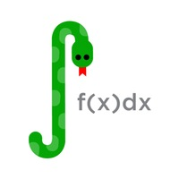

#  Курс 1 "Python и математика для анализа данных"

В этом курсе вы познакомитесь с фундаментальными математическими понятиями, необходимыми для анализа данных, и получите начальный навык программирования на Python. Курс состоит из двух больших частей. Первая часть курса – практическая, она посвящена языку программирования Python. Вы познакомитесь с синтаксисом и идеологией языка, научитесь писать простые программы. Также вы узнаете о библиотеках, которые часто применяются на практике для анализе данных, например, NumPy, SciPy, Matplotlib и Pandas. Вторая часть курса посвящена таким разделам математики как линейная алгебра, математический анализ, методы оптимизации и теория вероятностей. При этом, упор делается на разъяснение математических понятий и их применение на практике, а не на вывод сложных формул и доказательство теорем.

## Неделя 1: Введение
### Знакомство с Python
  * _Конспект_ [Введение в Python](week_1/materials/Vvedenie.pdf)
  * _Конспект_ [Синтаксис Python](week_1/materials/Programmirovanie-na-Python.pdf): _синтаксис, типы данных, чтение и запись в файл_
  * _Notebook_ [Знакомство с ipython](week_1/notebooks/introduction_to_ipython.ipynb)
  * _Notebook_ [Типы данных](week_1/notebooks/types_in_python.ipynb)
  * _Notebook_ [Чтение данных из файла](week_1/notebooks/ipython_files_data_reading.ipynb)
  * _Notebook_ [Запись данных в файл](week_1/notebooks/ipython_files_data_writing.ipynb)

### Основы математического анализа ###
  * _Конспект_ [Основы математического анализа](week_1/materials/Osnovy-matematicheskogo-analiza.pdf): _понятие функции действительной переменной, предел функции, производная, экстремумы, выпуклость_
  
## Неделя 2: Библиотеки Python и линейная алгебра
### Библиотеки NumPy, Matplotlib, SciPy, Pandas
  * _Notebook_ [Pandas DataFrame](week_2/notebooks/pandas_dataframe.ipynb)
  * _Notebook_ [Pandas: индексация и селекция](week_2/notebooks/pandas_indexing_selection.ipynb)
  * _Notebook_ [Первое знакомство с NumPy, SciPy и Matoplotlib](week_2/notebooks/NumPy_-SciPy_-Matplotlib-intro.ipynb)
  * _Notebook_ [Решение оптимизационных задач в SciPy](week_2/notebooks/SciPy-Optimization.ipynb)
  
### Линейная алгебра
  * _Конспект_ [Знакомство с линейной алгеброй](week_2/materials/Znakomstvo-s-linejnoj-algebroj.pdf): _признаковое описание, векторное пространство, линейная независимость, норма и скалярное произведение векторов_
  * _Конспект_ [Матрицы и основные матричные операции](week_2/materials/Matricy-i-osnovnye-matrichnye-operacii.pdf): _определение матриц, матричные операции, ранг и определитель, системы линейных уравнений, типы матриц, понятие собственного вектора_

### [Assignment](week_2/assignment_1/assignment.ipynb) Линейная алгебра: сходство текстов и аппроксимация функций
#### Задача 1: Сравнение предложений
Дан набор предложений, скопированных с Википедии. Каждое из них имеет "кошачью тему" в одном из трех смыслов:
 * кошки (животные)
 * UNIX-утилита cat для вывода содержимого файлов
 * версии операционной системы OS X, названные в честь семейства кошачьих 

Ваша задача — найти два предложения, которые ближе всего по смыслу к расположенному в самой первой строке. В качестве меры близости по смыслу мы будем использовать косинусное расстояние.

#### Задача 2:  аппроксимация функции
Задача состоит в том, чтобы посмотреть на то, как можно приблизить сложную математическую функцию многочленом.
